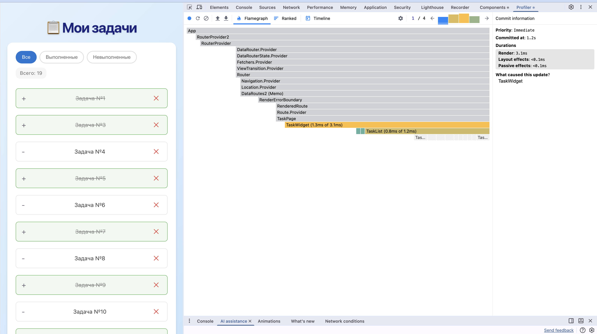
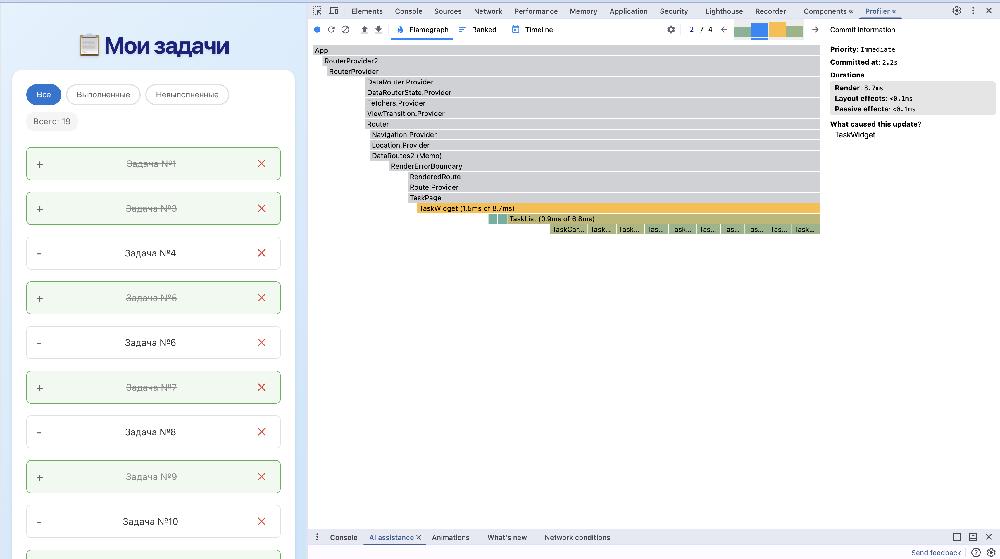
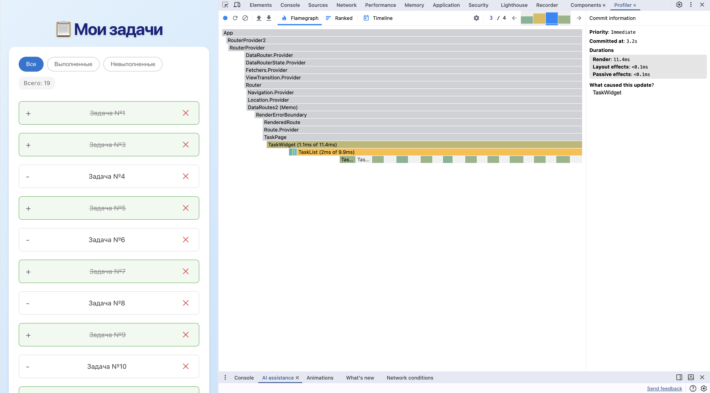

# LESSON 2 Профилирование

на скринах коммиты из записи профайлера для демонстрации преимущества оптимизаций которые мы применили

## Коммит 1 из 4 клик по фильтру выполненные

справа what caused this update TaskWidget апдейт пошёл от виджета поменялось состояние filter render 3.1ms

по флеймграфу перерисовались TaskWidget 1.3ms из 3.1ms и TaskList 0.8ms дальше цепочка сработала пересчитался useMemo и отдал новый отфильтрованный массив

а вот TaskCard самое интересное почти все карточки заштрихованы серым по краям реакт их пропустил перерисовались только те что сменились в списке остальные объекты task те же ссылки не поменялись memo отработал

всё что выше App RouterProvider провайдеры серое не рендерилось смена фильтра осталась локально в виджете

вывод по коммиту меняется фильтр над 20 задачами а React перерисовывает не 20 карточек а единицы это и есть эффект memo на списке заметнее чем на четырёх задачах

левая панель показывает всего 19 это уже текущее состояние после всех кликов включая удаление в конце записи флеймграф же это именно первый коммит клик по фильтру

## Коммит 2 из 4 клик по фильтру невыполненные

снова TaskWidget ререндерился опять смена фильтра

и вот тут ключевое отличие от коммита 1 в первом коммите почти все TaskCard были заштрихованы серым а здесь целый ряд TaskCard залит цветом то есть они реально ререндерились

тут мемоизация не спасла, потому что этот клик переключает фильтр на набор задач которого раньше на экране не было предыдущий фильтр показывал одни задачи новый показывает другие это новые карточки для React их не с чем сравнивать они монтируются и рендерятся с нуля

отсюда и время TaskList 0.9ms из 6.8ms почти все 6.8ms ушло на отрисовку новых TaskCard внутри

вывод по двум коммитам вместе

1. Коммит 1 фильтр оставил часть тех же задач memo пропустил их рендер дешёвый 3.1ms
2. Коммит 2 фильтр сменил набор задач полностью карточки новые все рендерятся memo не помогает 8.7ms

## Коммит 4 из 4 удаление карточки

смотри на TaskList почти всё заштриховано серым цветом залита только одна TaskCard в начале

тут виден смысл useCallback удалили одну задачу у всех остальных объект task тот же ссылка onRemove стабильна потому что обёрнута в useCallback пропсы карточек не изменились мемо их пропустил реакт

итог по всем 4 коммитам для дз

1. коммит 1 фильтр частичное совпадение memo сэкономил 3.1ms
2. коммит 2 фильтр набор сменился полностью все карточки новые memo не помог 8.7ms
3. коммит 3 фильтр вернулась половина memo сэкономил на второй половине 11.4ms
4. коммит 4 удаление memo плюс useCallback перерисовалась одна карточка вместо 19 4.3ms

два компонента для анализа по заданию TaskWidget всегда источник апдейта TaskList плюс дочерние TaskCard где мемо и решает рендерить или пропустить

